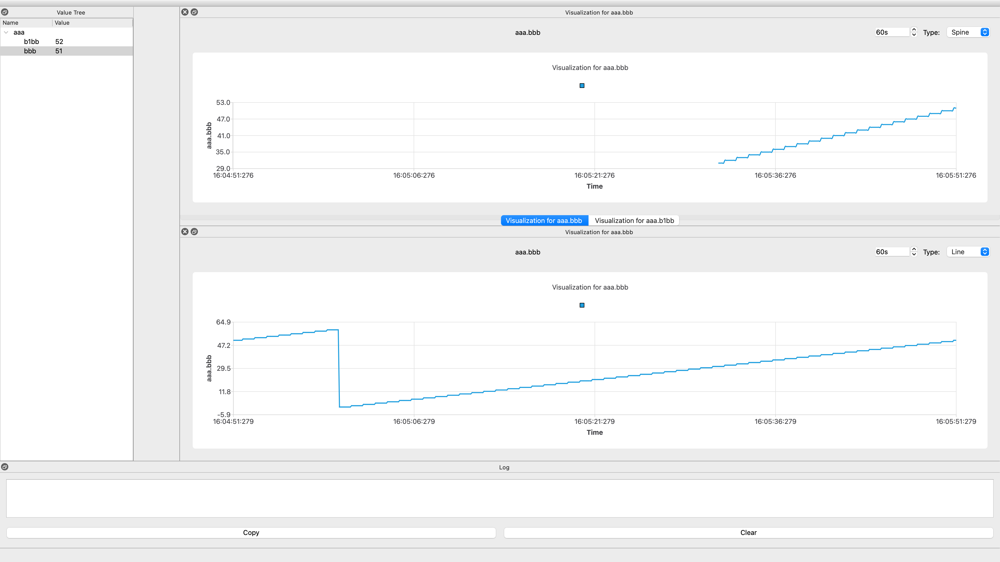

# GKD Mointor
GKD Monitor是一个运行状态的监视器。在连接上网络后，nuc会将运行过程中的各种变量发送到这个程序。每个变量都有一个名字，以 "." 分割，表示变量的层级关系。GKD Monitor会解析这个变量名，并以树形的形式展示在表格中。当有一些变量需要特别关注时，你可以创建一个图表，例如折线图，来更好地实时监控它的变化。在未来，GKD Monitor还会支持自定义Lua脚本来处理数据并告警、接收机器人的弹窗信息，等等。




## How to build

GUI是Qt写的，如果你有时间，可以先去下个几十个G的Qt然后按照下面的步骤来。

这个项目使用 现代的 先进的 好用的 科学的 **XMake** 来构建：

```bash
xmake build
```

然后你可以在 `build` 目录下面的某个神秘子目录找到程序。或者，使用命令来运行：

```bash
xmake run
```

## 数据格式

下面是建立tcp连接后，传输数据的格式：

```cpp
struct{
		uint16_t package_size;
  	uint8_t message_type;
    ...
}
```

数据包的前两个字节代表数据包的长度，紧跟着一个字节代表消息类型。现在，消息有三种类型：

- Register Name:注册一个变量名，避免每次都把name发过来
- Update Value:更新某个变量的值
- Console Message:向日志区输出日志，使用HTML格式
- MessagBox Message:让Monitor弹窗

## Register Name

```cpp
struct{
	uint16_t package_size;
  	uint8_t message_type = 0x00;
  	uint8_t name_length;
  	char name[name_length];
}
```

## Update Value

Update Value消息的格式如下：

```cpp
struct{
	uint16_t package_size;
  	uint8_t message_type = 0x01;
	uint32_t id;
    double value;
}
```


## Console Message

```cpp
struct{
	uint16_t package_size;
  	uint8_t message_type = 0x02;
  	uint16_t message_length;
  	char message[message_length];
}
```

## MessageBox Message

```cpp
struct{
	uint16_t package_size;
  	uint8_t message_type = 0x02;
  	uint16_t message_length;
  	char message[message_length];
}
```

